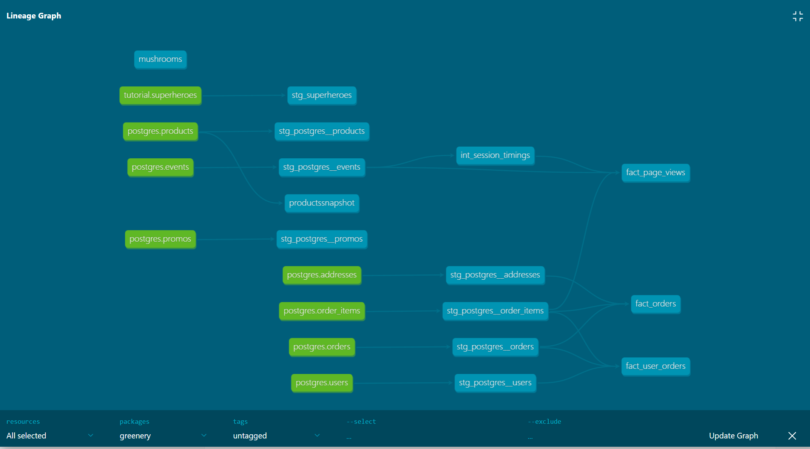
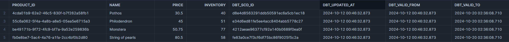

# project 2 answers


### what is our user repeat rate?
**Answer:** 0.798

**Query**
```
select count_if(is_frequent_buyer) / count(*) 
from dev_db.dbt_mabouaudagmailcom.fact_user_orders
where is_buyer = TRUE
```

**fact table**
```
with

users as (
    select * from {{ ref('stg_postgres__users') }}
),

user_orders as (
    select
        user_id,
        min(created_at) as first_order_created_at,
        max(created_at) as last_order_created_at,
        sum(order_cost) as total_spend,
        count(order_id) as orders
    from {{ ref('stg_postgres__orders') }}
    group by 1
),

 products_purchased as (
    select
        o.user_id,
        count(oi.product_id) as products_purchased
    from {{ ref('stg_postgres__order_items') }} oi
    left join {{ ref('stg_postgres__orders')}} o
        on o.order_id = oi.order_id
    group by 1
 )

select
    u.user_id,
    o.orders is not null as is_buyer,
    coalesce(o.orders, 0) >= 2 as is_frequent_buyer,
    o.first_order_created_at,
    o.last_order_created_at,
    o.orders,
    coalesce(o.total_spend, 0) as total_spend,
    coalesce(p.products_purchased, 0)  as products_purchased
from users u
left join user_orders o
    on o.user_id = u.user_id
left join products_purchased p
    on p.user_id = u.user_id
```


### What are good indicators of a user who will likely purchase again? What about indicators of users who are likely NOT to purchase again? If you had more data, what features would you want to look into to answer this question?

**Answer:** I would be able to know if a user would purchase again based on two factors:
- frequencey of buying
- site retention. 

for example: a good indicator would be if the buyer is a frequent buyer; meaning they have more than 2 orders and/or frequently visits the site. 

### Explain the product mart models you added. Why did you organize the models in the way you did?
**Answer:** I asssumed the product team, would like to know to information about how the user behaviour is on the site "fact_page_views". They would be able to know which product the users interacted with, their length of session on the site, and their conversion funnel using event types.

I assumed the marketing team "fact_user_orders" would like to know which users bought nothing or one product or are they frequent buyers so they can use various marketing strategies to bring them back. Also would be interesting to know how much each user spends to maybe give them special promos/discounts. 

There is also the core data for everyone to use "fact_orders" if stakeholders you could get all the information possible on a certain user or order.



## Part 2
____

### What assumptions are you making about each model? (i.e. why are you adding each test?)
**Answer:** I assumed that for each model the ID data was unique and not null (ex. I added two tests: unique and not_null)

I added a test called "accepted_vlaues" to check event types can only be one of these four:    
- checkout
- package_shipped
- add_to_cart
- page_view


I added a final test called "relationships" to show that the user_id exists/related in both the "events" and "users" staging tables


### Did you find any “bad” data as you added and ran tests on your models? How did you go about either cleaning the data in the dbt model or adjusting your assumptions/tests?
**Answer:** I did not find any bad data based on the tests I mentioned


### How to ensure that the tests are passing regularly and how to alert stakeholders about bad data getting through?
**Answer:** I'd setup tests for validation and I would schedule them to run everyday in the cloud. I would also setup notifications through Slack for the stakeholders to be able to maintain it. 

## Part 3
____

### Which products had their inventory change from week 1 to week 2? 
**Answer:** The products that had their inventory change from week 1 to week 2 are: Pothos, Philodendron, Monstera, String of Pearls

