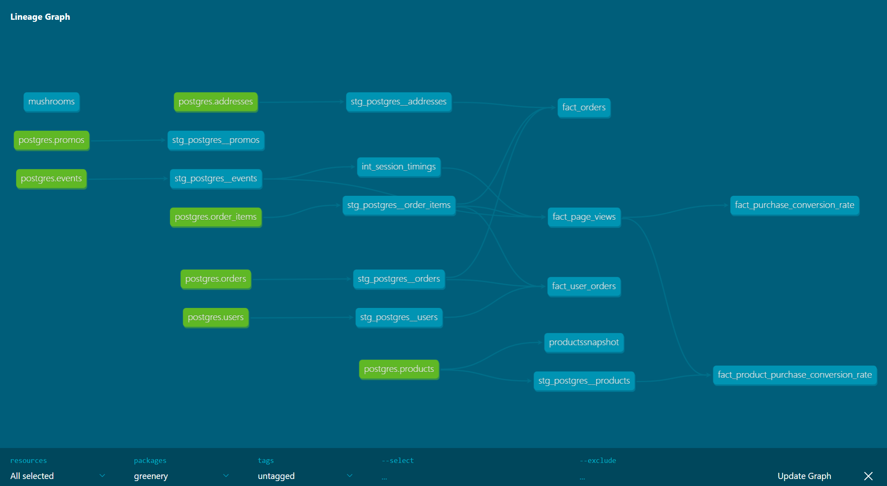

# project 3 answers

### What is our overall conversion rate?
**Answer:** %62.4

```
SELECT PURCHASE_CONVERSION_RATE FROM DEV_DB.DBT_MABOUAUDAGMAILCOM.FACT_PURCHASE_CONVERSION_RATE
```

### What is our conversion rate by product?
**Answer:**
from table fact_product_purchase_conversion_rate

Pothos 0.3442622951
, Bamboo 0.5373134328
, Philodendron 0.4838709677
, Monstera 0.5102040816
, String of pearls 0.609375
, ZZ Plant 0.5396825397
, Snake Plant 0.397260274
, Orchid 0.4533333333
, Birds Nest Fern 0.4230769231
, Calathea Makoyana 0.5094339623
, Peace Lily 0.4090909091
, Bird of Paradise 0.45
, Fiddle Leaf Fig 0.5
, Ficus 0.4264705882
, Pilea Peperomioides 0.4745762712
, Angel Wings Begonia 0.393442623
, Jade Plant 0.4782608696
, Arrow Head 0.5555555556
, Majesty Palm 0.4925373134
, Spider Plant 0.4745762712
, Money Tree 0.4642857143
, Cactus 0.5454545455
, Devil's Ivy 0.4888888889
, Alocasia Polly 0.4117647059
, Pink Anthurium 0.4189189189
, Dragon Tree 0.4677419355
, Aloe Vera 0.4923076923
, Rubber Plant 0.5185185185
, Ponytail Palm 0.4
, Boston Fern 0.4126984127

## Part 2: We’re getting really excited about dbt macros after learning more about them and want to apply them to improve our dbt project.
**Answer:** I removed the case when statements around event types in fact_page_views.sql and instead have them automatically populate through a macro in sum_of.sql. I installed the dbt-utils package and used it to return the event types in stg_postgres__events


## Part 3: We’re starting to think about granting permissions to our dbt models in our snowflake database so that other roles can have access to them. Add a post hook to your project to apply grants to the role “reporting”. You can use the grant macro example from this week!
**Answer:** I granted the role in grants.sql


## Part 4: After learning about dbt packages, we want to try one out and apply some macros or tests. Install a package (i.e. dbt-utils, dbt-expectations) and apply one or more of the macros to your project
**Answer:** I used dbt_utils and applied it in fact_page_views.sql


## Part 5: After improving our project with all the things that we have learned about dbt, we want to show off our work! Show (using dbt docs and the model DAGs) how you have simplified or improved a DAG using macros and/or dbt packages.
**Answer:** 



## Part 6: dbt Snapshots. Let's update our products snapshot again to see how our data is changing:
**Answer:** 

Monstera 77 > 64
String of pearls 58 > 10
Philodendron 51 > 25
Pothos 40 > 20


