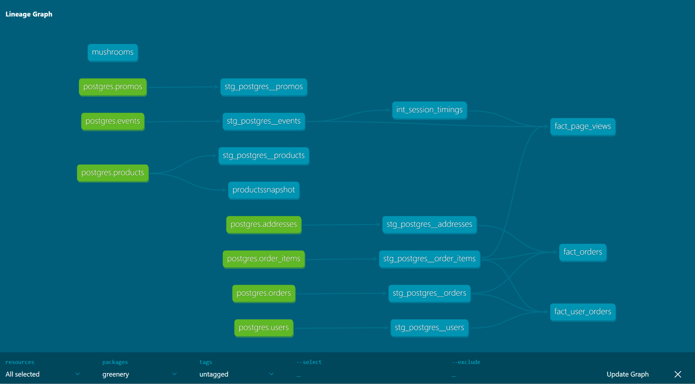

# project 3 answers

### What is our overall conversion rate?
**Answer:**

### What is our conversion rate by product?
**Answer:**

## Part 2: We’re getting really excited about dbt macros after learning more about them and want to apply them to improve our dbt project.
**Answer:**

## Part 3: We’re starting to think about granting permissions to our dbt models in our snowflake database so that other roles can have access to them. Add a post hook to your project to apply grants to the role “reporting”. You can use the grant macro example from this week!
**Answer:**

## Part 4: After learning about dbt packages, we want to try one out and apply some macros or tests. Install a package (i.e. dbt-utils, dbt-expectations) and apply one or more of the macros to your project
**Answer:**

## Part 5: After improving our project with all the things that we have learned about dbt, we want to show off our work! Show (using dbt docs and the model DAGs) how you have simplified or improved a DAG using macros and/or dbt packages.
**Answer:**I made the code more effecient but I don't think it shows in the dag

