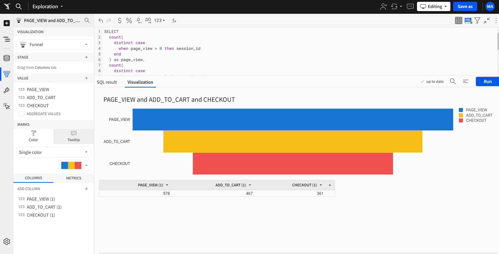
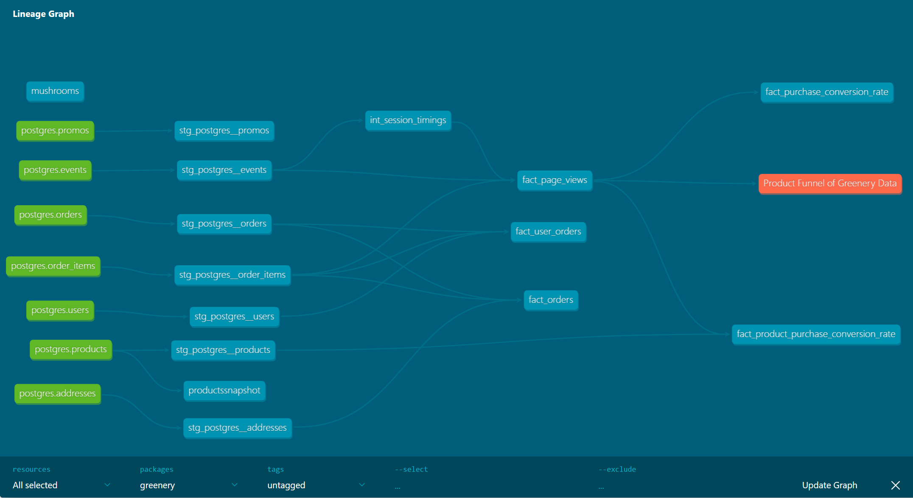

# project 4 answers

## part 1: dbt snapshot


### Which products had their inventory change from week 3 to week 4?
**Answer:**

Pothos
String of pearls
Philodendron
Monstera
ZZ Plant
Bamboo

```
SELECT * 
FROM DEV_DB.DBT_MABOUAUDAGMAILCOM.PRODUCTSSNAPSHOT
WHERE date_trunc(week, dbt_valid_to) = date_trunc(week, current_date);
```

### Now that we have 3 weeks of snapshot data, can you use the inventory changes to determine which products had the most fluctuations in inventory? Did we have any items go out of stock in the last 3 weeks? 
**Answer:**

Items that had the most fluctuations:
Pothos
String of pearls
Philodendron
Monstera
ZZ Plant
Bamboo

Items that went out of stock on week 3:
Pothos
String of pearls

```
SELECT * 
FROM DEV_DB.DBT_MABOUAUDAGMAILCOM.PRODUCTSSNAPSHOT
WHERE product_id in
(SELECT product_id 
FROM DEV_DB.DBT_MABOUAUDAGMAILCOM.PRODUCTSSNAPSHOT
group by 1
having count(1) > 1)
order by product_id, dbt_valid_from
```

## part 2: modeling challenge

### How are our users moving through the product funnel?



### Expouser

